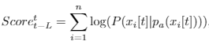
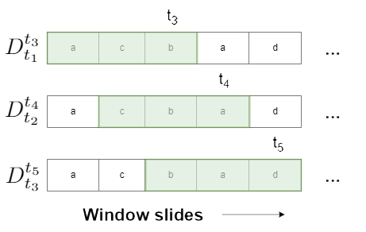

## System description

DBNOD is a R and Java implementation of a complete multivariate time series (MTS) outlier detection system covering problems from pre-processing to post-score analysis. It adopts dynamic Bayesian network (DBN) modeling with the conjunction of a sliding window approach to uncover observations suspected of not have been generated by data’s underlying processes. The system is formed by 4 main phases depicted in the image below. Most outlier detection methods focus solely on univariate series, providing analysts with strenuous solutions. The presented approach is capable of tackling multivariate longitudinal datasets through a widely accessible **[web application](https://jorgeserras.shinyapps.io/outlierdetection/)** made available with a tutorial.

Instructions for the offline employment of the web application when downloaded is available **[below](#usage)** along with information concerning **[input data](#input-data)**. In the current page there is a breaf explanation of the **[several phases](#pre-processing)** within the application. References and additional published material should be examined for additional insight.


Datasets containing MTS are pre-processed prior to modeling if necessary. The pre-processing phase studied is performed using a discretization and dimension reduction technique kown as Symbolic  Aggregate  approX-imation (SAX). Discrete MTS datasets are then employed to the tDBN modeling algorithm, which generates a DBN according to the inserted dataset and parameters chosen. The latter are the Markov lag _L_, the number of parents _p_ from preceding frames each node can possess and a flag deciding the stationarity of the model. Afterwards, the MTS dataset together with the trained model are delivered to a scoring phase. The aforementioned capitalizes on the structure and parameters of the model to analyze each MTS transition using a sliding window algorithm. Entire series are likewise scored. Subsequently, scores are delivered to a score-analysis strategy which the main goal is to create a boundary differentiating abnormal from normal scores. Two possible strategies are discussed in the present work and later compared, being this the Tukey's method and a Gaussian mixture model (GMM). A score-analysis strategy outputs a threshold used for the final binary classification. Original data associated to scores below the threshold are classified as outliers.

## Usage

There are two ways of utilizing the outlier detection system. Users can access the online **[web application](https://jorgeserras.shinyapps.io/outlierdetection/)** or download the source code for an offline use. The first does not need any additional effort. A tutorial is available to assure an immediate use, conforming to both the online and offline versions.

The online version can have several drawbacks, being the main ones the availability of the server and the inability of resolving very large/complex datasets. To tackle such scenarios, users are encouraged to download and employ the system in their own setups, being thus independent of third parties. A step-by-step guide for making use of the developed approach offline for the first time is available next:

1. Install the latest **[Java JDK](https://www.oracle.com/technetwork/java/javase/downloads/index.html)** (needed for the modeling/scoring phase).

2. Download and install R by selecting through one of the available **[mirrors](https://cran.r-project.org/mirrors.html)**.

3. Download and install the Free version of **[RStudio](https://www.rstudio.com/products/rstudio/download/#download)** (needed for Shiny application).

4. Download the project **[here](https://github.com/jorgeserras/MTS_OutlierDetection/zipball/master)** or through **[Github](https://github.com/jorgeserras/MTS_OutlierDetection)** and unzip it into a folder.

5. Open RStudio and open the R script "installation.R" in the folder of the project: (File -> Open File -> choose installation.R). Run the script, this will install all necessary packages and dependencies. If an error occurs in the installation of rJava, please verify the installation of the JDK in step 1.

6. Still in RStudio, open the downloaded project in the same folder as in step 5: (File -> Open Project -> choose OutlierDetection.Rproj). 

7. The script "app.R" should now be opened in RStudio. Click "Run app" to launch the application. If a **[window pops up](https://image.ibb.co/g9WMa0/prompt.png)** requesting the installation of Shiny, choose "yes", otherwise it is already installed.

8. The app should now be running in a seperate window, select "Open in Browser" in the **[top left corner](https://image.ibb.co/eMjUTL/open-in-browser.png)**. The application is now displayed in the predefined browser (required to correctly interpret web development programming).

9. Enjoy!

### Input-data

The implemented application is designed to handle MTS. A univariate TS is seen as a set of observations along a consistent time rate expressing the values of a variable along a certain number of time-stamps _T_. For the case of MTS, each row of a data-set represents a subject identified by its row index. Subjects are MTS with a common number of variables _n_ and width _T_. Each column depicts a certain variable at a certain time slice. A subject is thus a combination of univariate TS.

The input file should be in comma-separated values (CSV) and in an horizontal format. A formatting procedure as well as example files are available in the **[web application](https://jorgeserras.shinyapps.io/outlierdetection/)**.

- The first row of the file is the header, being the first entry "subject_id" and the remaining ones the attributes specifying their time slice index, separated by two unserscores: "attributeName__t".

- Attributes must be sorted by time: "attribute1__1", "attribute2__1", "attribute1__2", "attribute2__2" ...

- The first column contains an identification for each subject (multivariate time series), it cannot contain duplicates and non-numeric values (due to graphical interface issues). The subject_id column typically corresponds to a sorted array of integers.

- Every row (except the first one) represents observations of a multivariate time series from a specific subject over time.

- Data can be continuous or discrete. In the case of continous data, a pre-processing phase is available.

- Missing values are not permitted, these should be replaced by an additional symbol or imputted beforehand.

Example of a continuous imput file:

```
"subject_id","X1__1","X2__1","X3__1","X4__1","X1__2","X2__2","X3__2","X4__2"
1, 57, 67, -3, 4, 39, 70, -3, 7
2, 46, 27,  2, 7, 56, 30,  0, 7
3, 45, 10,  8, 8, 45, 13,  5, 4
4, 60, 17,  5, 3, 48, 35,  4, 8
(...)

```


## Main Phases

### Pre-Processing

Real-world datasets have a tendency to be continuous and of high dimension. Un-discretized variables foment an heavy and over-fitted model which ends up behaving poorly. The same can be said to over-sampled data. Being the trained model a DBN, pre-processing is required.

A representation known as Symbolic Aggregate approXimation (SAX) is enforced on each input time series (TS) prior to the modeling phase if necessary. The procedure is applied to each univariate TS separately. Each series is then combined to form a discrete MTS dataset, each with an alphabet size chosen in the application. The SAX procedure is seen as 3 steps:

1. Normalization: Every TS is normalized to present zero mean and a standard deviation of one, such is achieved by employing Z-normalization. The mean of a TS is subtracted from every data point. The result is then divided by the TS' standard deviation.

2. Dimensionality Reduction: Each TS of length T can be compressed into equivalent sequences of size m < T. Such can be assured by Piecewise Aggregate Approximation (PAA). The latter subdivides a normalized TS into m equally sized windows. The mean of each window of size T/m is computed replacing all its values. The m means of each window serve as the new TS.

3. Symbolic Discretization: Normalized TS typically have Gaussian distributions. Hence, their domain can be divided into a set of equiprobable regions according to a Gaussian distribution N(0,1). Each region depicts a symbol from the alphabet size chosen. Regions are identified by boundaries, known as breakpoints. The goal is to resolve in which of the regions each TS point resides. A value falling in a certain region is transformed into the symbol associated to that region.

Note that PAA can be overlooked, being normalized TS directly discretized without performing dimensionality reduction.

#### EXAMPLE

Consider a TS comprised by 8 points. After normalizing the series, a PAA transformation of length 3 is employed, creating 3 windows of equal length. 3-point PAA transform can be seen in the image below. The latter is converted to the string "acb" considering an alphabet size of 3, being each symbol region visable in purple in the image. The procedure employs the R package JMotif REF THIS.


The pre-processing procedure must be applied to every variable preferably with the same choice of parameters when handling MTS, meaning that a MTS subject with n variables requires n SAX discretizations. The selection of such values can have a considerable impact on the course to come. While the PAA parameter determines the level of proximity and memory spent for describing a TS, the alphabet size represents the granularity of expressing each element. With this in mind, it can be shown that for most applications an alphabet size in the range of 5 to 8 normally outputs good results.


### Modeling and Scoring

In the web application, the modeling and scoring phases are performed at the same time, being the user responsible for selecting the parameters of the model. The latter can be changed afterwards to test other models.

#### Modeling

Define transition/window antes

Temporal dependencies within and between discrete variables can be modeled using dynamic Bayesian networks (DBN) which extend traditional Bayesian networks to temporal processes. These are graphical statistical methods capable of encoding conditional relationships of complex MTS structures. A modeling technique known as **[tree-augmented DBN (tDBN)](http://josemonteiro.github.io/tDBN/)** is used to provide a network possessing optimum inter/intra-slice connectivities for each transition network, verified to outperform existing literature. An attribute node at a certain time-slice can only possess at most one parent at that same slice. Furthermore, in each node, the maximum number of parents from preceding time slices is bounded by a parameter _p_. Both stationary and nonstationary DBNs are studied. The model provides a normality standard for anomaly detection.

The user can specify the value of both parameters _L_ and _p_, representing respectively the order (lag) and the number of preceding parents of each node wllowed. The user can furthermore choose between a stationary or non-stationary model. A stationary DBN uses a common transition network for every transition of the dataset, being thus ideal for series with statistical properties invariant of time. On the other hand, non-stationary DBNs acquire a transition network for every transition, adapting to statistical properties which change through time.

#### Scoring

In the present system, an outlier is defined as being a single or set of observations belonging to a subject which is suspicious of not being generated by the data's main underlying processes, being typically caused by qualitatively distinct mechanisms.

A window is defined as a sample of a discrete MTS with n variables at a specified time interval, having a size equal to _n(L+1)_. The DBN's order is represented by _L_. A window is described as


where _t_ identifies the last time frame present in the window and is equal or higher than _L_. Attributes of a certain time slice _t_ are conditioned by nodes no later than _L_ prior time frames, being such dependent on the DBN structure. All the information mentioned is akin when considering both stationary and non-stationary DBNs.

The model is composed by a prior network and a transition network for each transition _t-1 -> t_ in the case of a first-order DBN. A Transition is associated to a window composed by the observed attributes required to compute its corresponding anomaly score. A transition score is computed as

<p align="center">
        
</p>

where the probability of attribute _xi[t]_ conditioned by its parent nodes' values _pa(xi[t])_ is used. The latter can be attributes from the same time frame or prior ones according to the transition network. The equation portrays the log-likelihood (LL) of the transition, which indicates the probability of the observations of time frame _t_ given the window's observations. It is worth noting that a transition score represents the outlierness of the transition and not the time slice. However, if the evidence possesses an unseen pattern, the probability of at-least an attribute is zero, nullifying the LL score associated to it. A technique known as probability smoothing is employed to prevent score disruption for unseen patterns.

To acquire the outlierness of every MTS transition, a sliding window is employed. The latter can be seen as a sub-network of a DBN over consecutive time slices. The mechanism gradually captures all equally sized windows of a subject to compute the LL scores for each transition. Since the trained model possesses an initial network, time frames _t_ lower or equal to _L_ can not be explained by windows of size _n(L+1)_. Hence, according to the model's order, only transitions from slice _L+1_ forward are captured. However, the initial frames influence the scores of the next consecutive windows which include them, having the ability of inducing anomalies. Furthermore, subject scoring is made available, offering the detection of anomalous MTS. A straightforward approach is considered, being a subject outlierness equal to the mean of every transition score of that subject.

#### EXAMPLE

MENTION THE SMALL UNIVARIATE EXAMPLE OF THE IMAGE

<p align="center">
        
</p>


The next step is to apply score analysis to discern the final decision boundary between normal and anomalous scores. Scores below a specified value are classified as outliers.

### Score-Analysis

Two score-analysis strategies are studied to elect an optimum threshold for outlier disclosure amidst scores. These strategies analyze the scores of each transition and subject and determine a boundary to discern the two classes, normality and abnormality.

#### Tukey's strategy

One can define abnormal scores as values that are too far away from the norm, presuming the existence of a cluster comprising normality. The current technique has inspiration in John Tukey's method, which determines the score's interquartile range (IQR) as _IQR = Q3 - Q1_, where _Q1_ and _Q3_ are the first and third quartiles respectively. The IQR measures statistical dispersion, depicting that 50% of the scores are within more or less _0.5IQR_ from the median. By ignoring the scores' mean and standard deviation, the impact of extreme scores does not influence the procedure. The IQR is hence a measure of variability robust to the presence of outliers.

Tukey uses the notion of fences, frontiers which separate outliers from normal data. The proposed approach typically generates negatively skew score distributions. Hence, a lower fence computed as _Q1 – (1.5IQR)_ is used. Transition and subject scores are classified as abnormal if their value subsists below their respective lower fence, since these are low likelihood entities. Thus, scores holding inequality

<p align="center">
        
</p>
        
are considered abnormal, being _Q1 - (1.5IQR)_ the threshold. Tukey's procedure prefers symmetric score distributions with a low ratio of outliers having a breakdown at about 25%. In scenarios with absence of anomalies, this mechanism is capable of completely eliminating false positive occurrences, since fences are not forced to be in the data's observed domain.

#### Gaussian mixture model strategy

To handle disjoint score distributions, a method based on a Gaussian Mixture Model (GMM) is employed. Commonly used in classification and clustering problems, GMMs are probabilistic models that assume data is generated from a finite mixture of Gaussian distributions with unknown parameters. Most real-world phenomena has Gaussian like distributions. In the present system, score distributions are modeled as a mixture of two Gaussian curves. Labeling each score becomes a classification problem among two classes _C1_ and _C2_, representing normality and abnormality respectively. Such is interpreted as uncovering the value of _P(C1,C2|y)_ for each score value _y_, which can be obtained by employing Bayes Rule
<p align="center">
        
</p>
where _P(y|Ci)_ is the likelihood of score _y_ belonging to class _Ci_, _P(Ci)_ the priors for each class and _P(y)_ the evidence. The threshold is the boundary that better separates both curves, which describes the point of maximum uncertainty. A score _y_ is classified as anomalous if _P(y|C1)P(C1)>P(y|C2)P(C2)_. Such is known as the Bayes Classification Rule (BCR), which provides the desired boundary. To discover the parameters of each Gaussian distribution, the current system adapts an available R package mclust REF THIS. The GMM strategy can handle discontinued score distributions, however, it assumes the existence of an outlier cluster. Thus, Tukey's and GMM strategies expect distinct scenarios.

## References


## Support and Contact

Having trouble with Pages? Check out our [documentation](https://help.github.com/categories/github-pages-basics/) or [contact support](https://github.com/contact) and we’ll help you sort it out.
